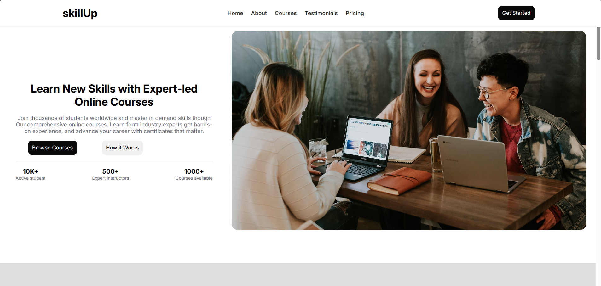
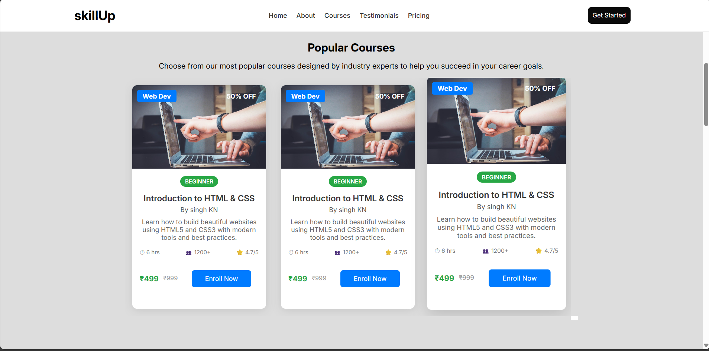
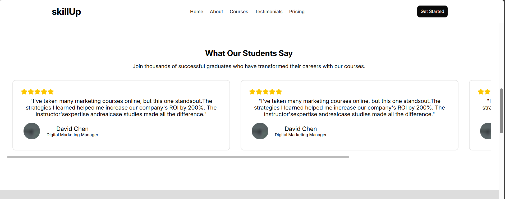
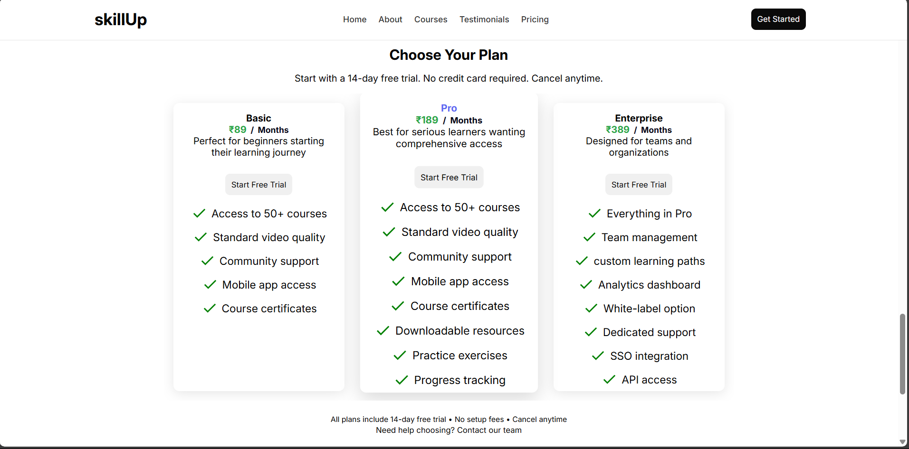
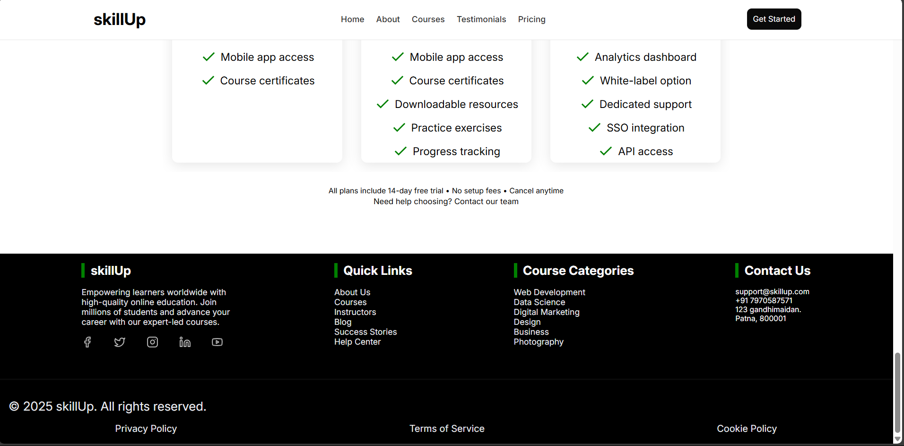

# Course Seller Landing Page 📚 

This repository showcases a **visually appealing landing page design** for a course selling website. It is meant to serve as a blueprint or UI prototype before development.

🔗 [Live Figma Design Link](https://www.figma.com/make/trSCPF8u8rfvEMG39mkkeP/Course-Seller-Landing-Page?fullscreen=1)

---

## 🖼️ Screenshots

> Save these screenshots in an `assets/` folder within your project directory.

```
project-root/
├── README.md
├── script.css
├── utlity.css
├── app.js
├── assets/
│   ├── hero-section.png
│   ├── about-section.png
│   ├── course-scroll-section.png
│   ├── testimonials-section.png
│   ├── compare-programs.png
│   ├── service-pricing.png
│   └── footer-section.png 
├── images/
│   ├── facebook.svg
│   ├── instagram.svg
│   ├── twiter.svg
│   ├── linkdin.svg
│   ├── youtube.svg
│   ├── 
│   ├── Other images
```

### 📌 Page Preview:

- **Hero Section**  
  

- **About Section**  
  

- **Scrollable Courses Section**  
  

- **Testimonials**  
  

- **Compare Our Programs**  
  

- **Service Pricing (₹99 / ₹199 / ₹499)**  
  

- **Footer**  
  

---

## ✨ Features in the Design

- **Modern, clean layout** optimized for usability
- Visual distinction between plans & services
- Easy-to-navigate sections with clear call-to-actions
- Consistent use of typography, spacing, and color palette
- Scalable design system for desktop and mobile responsiveness

---

## 🔧 Tools Used

- 🎨 [Figma](https://www.figma.com) – UI/UX Design & Prototyping Tool
- CSS
- HTML 5

---

## 💡 How to Use

1. Open the [Figma link](https://www.figma.com/make/trSCPF8u8rfvEMG39mkkeP/Course-Seller-Landing-Page?fullscreen=1)
2. Duplicate the file to your workspace (File → Duplicate)
3. Customize the design as needed for your project
4. Export assets and use in development

---

## 📬 Contact

If you want this design converted into a real website or need help integrating it into your project, feel free to connect:

📧 Email: [thnnivash@gmail.com](mailto:thnnivash@gmail.com)  
🌐 Website: [www.skillup.com](https://www.skillup.com)

---

> © 2025 SkillUp. Design by **Nivash Kumar (Singh KN)**.
